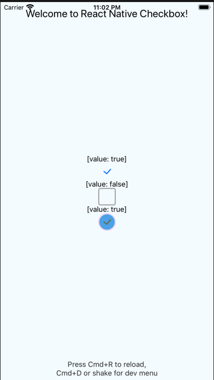

# `@react-native-community/checkbox`
[](https://circleci.com/gh/react-native-community/workflows/react-native-checkbox/tree/master)   [](https://www.npmjs.com/package/@react-native-community/checkbox) [](https://github.com/facebook/react-native/issues/23313)

React Native component for Checkbox

Android Example             |  IOS Example
:-------------------------:|:-------------------------:
  |  
Windows Example             |


## Support

| RN version     | Checkbox version      |
| --------       | ----------------      |
| > 0.60         |  >= 0.3 (Support IOS from 0.4) |
| < 0.60         |  0.2 (only Android)   |
| >= 0.62 to run on Windows |

## Getting started

`yarn add @react-native-community/checkbox`

or

`npm install @react-native-community/checkbox --save`

On iOS, install cocoapods:

`npx pod-install`

On Windows, you need to [`manually link the module`](###Manual-installation) (until autolinking is published in RNW 63).

### Mostly automatic installation

From react-native >= 0.60 autolinking will take care of the link (on iOS and Android)

for react-native =< 0.59.X

`react-native link @react-native-community/checkbox`

### Manual installation

<details>
<summary>Manually link the library on Android</summary>
   
#### `android/settings.gradle`
```groovy
include ':react-native-community-checkbox'
project(':react-native-community-checkbox').projectDir = new File(rootProject.projectDir, '../node_modules/@react-native-community/checkbox/android')
```

#### `android/app/build.gradle`
```groovy
dependencies {
   ...
   implementation project(':react-native-community-checkbox')
}
```

#### `android/app/src/main/.../MainApplication.java`
On top, where imports are:

```java
import com.reactnativecommunity.checkbox.ReactCheckBoxPackage;
```

Add the `checkbox` class to your list of exported packages.

```java
@Override
protected List<ReactPackage> getPackages() {
    return Arrays.asList(
            new MainReactPackage(),
            new ReactCheckBoxPackage()
    );
}
```
</details>

<details>
<summary>Manually link the library on Windows</summary>

#### Add the CheckboxWindows project to your solution

1. Open the solution in Visual Studio 2019.
2. Right-click solution icon in Solution Explorer > Add > Existing Project.
   Select 'D:\pathToYourApp\node_modules\@react-native-community\checkbox\windows\CheckboxWindows\CheckboxWindows.vcxproj'.

#### **windows/myapp.sln**

Add a reference to `CheckboxWindows` to your main application project. From Visual Studio 2019:

Right-click main application project > Add > Reference...
Check 'CheckboxWindows' from the 'Project > Solution' tab on the left.

#### **pch.h**

Add `#include "winrt/CheckboxWindows.h"`.

#### **app.cpp**

Add `PackageProviders().Append(winrt::CheckboxWindows::ReactPackageProvider());` before `InitializeComponent();`.

</details>

## Migrating from the core `react-native` module
This module was created when the CheckBox was split out from the core of React Native. To migrate to this module you need to follow the installation instructions above and then change you imports from:

```javascript
import { CheckBox } from 'react-native';
```

to:

```javascript
import CheckBox from '@react-native-community/checkbox';
```

## Usage

### Example

```javascript
import CheckBox from '@react-native-community/checkbox';
```

```javascript
  const [toggleCheckBox, setToggleCheckBox] = useState(false)
  
  <CheckBox
    disabled={false}
    value={toggleCheckBox}
    onValueChange={(newValue) => setToggleCheckBox(newValue)}
  />
```

Check out the [example project](example) for more examples.

### Props

## Common Props

[View props...](https://reactnative.dev/docs/view#props)

| Prop name     | Type     | Description                                                                                                                                                                                                           |
| ------------- | -------- | --------------------------------------------------------------------------------------------------------------------------------------------------------------------------------------------------------------- |
| onChange      | function | Invoked on change with the native event.                                                                                                                                                                              |
| onValueChange | function | Invoked with the new boolean value when it changes.                                                                                                                                                                   |
| value         | boolean  | The value of the checkbox. If true the checkbox will be turned on. Default value is false.                                                                                                                            |
| testID        | string   | Used to locate this view in end-to-end tests.                                                                                                                                                                         
| disabled      | boolean | If true the user won't be able to toggle the checkbox. Default value is false.                      


## Android Only Props

| Prop name     | Type    | Description                                                                                                                                                                                                           |
| ------------- | ------- | ---------------------------------------------------------------------------------------------------------------------------------------------------------------------------------------------------------------------                                                                                                             |
| tintColors    | string  | An object with the following shape: `{ true?: ?ColorValue, false?: ?ColorValue }`. The color value for `true` will be used when the checkbox is checked, and the color value for `false` will be used when it is off. |

## IOS Only Props

| Prop name     | Type    | Description                                                                                                                                                                                                           |
| ------------- | ------- | ------------------------------------------------------------------------------------------------------------------------------------------------------------------------------------------------------------- |
| lineWidth     | boolean | The width of the lines of the check mark and box. Defaults to 2.0.                                                                                                                                        |
| hideBox       | boolean | Control if the box should be hidden or not. Defaults to false |
| boxType       | 'circle' or 'square' |  The type of box to use. Defaults to 'circle' |
| tintColor     | string  | The color of the box when the checkbox is Off. Defaults to '#aaaaaa' |
| onCheckColor  | string  | The color of the check mark when it is On. Defaults to '#007aff' |
| onFillColor   | string  | The color of the inside of the box when it is On. Defaults to transparent |
| onTintColor   | string  | The color of the line around the box when it is On. Defaults to '#007aff' |
| animationDuration   | number  | The duration in seconds of the animations. Defaults to 0.5 |
| onAnimationType   | 'stroke' or 'fill' or 'bounce' or 'flat' or 'one-stroke' or 'fade'  | The type of animation to use when the checkbox gets checked. Default to 'stroke' |
| offAnimationType   | 'stroke' or 'fill' or 'bounce' or 'flat' or 'one-stroke' or 'fade'  | The type of animation to use when the checkbox gets unchecked. 'stroke'|

## Windows Props
Implemented most of iOS and Android props. 
Defaults for color styling can be referenced here:
https://docs.microsoft.com/en-us/dotnet/framework/wpf/controls/checkbox-styles-and-templates

| Prop name     | Type    | Description                                                                                                                                                                                                           |
| ------------- | ------- | ------------------------------------------------------------------------------------------------------------------------------------------------------------------------------------------------------------- |
| disabled      | boolean | If true the user won't be able to toggle the checkbox. Default value is false.                                                                                                                                                                                           |
| tintColor     | string  | The color of the box when the checkbox is Off.|
| onCheckColor  | string  | The color of the check mark when it is On. |
| onFillColor   | string  | The color of the inside of the box when it is On. |
| onTintColor   | string  | The color of the line around the box when it is On. |

## Contributors

This module was extracted from `react-native` core.

The implementaion of IOS version refered to [BEMCheckBox](https://github.com/Boris-Em/BEMCheckBox)

## License
The library is released under the MIT licence. For more information see `LICENSE`.
