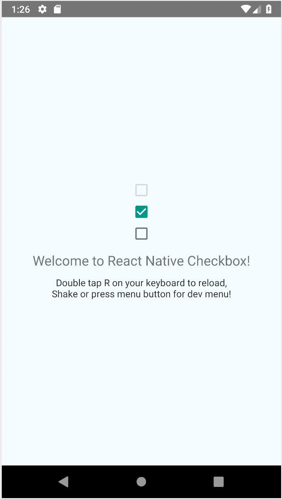

# `@react-native-community/checkbox`
[](https://circleci.com/gh/react-native-community/workflows/react-native-checkbox/tree/master)   [](https://www.npmjs.com/package/@react-native-community/checkbox) [](https://github.com/facebook/react-native/issues/23313)

**Note: checkbox doesn't support iOS. Please use Switch for iOS.**
**If you think it is necessary to support iOS, please discuss [here](https://github.com/react-native-community/react-native-checkbox/issues/35)**

React Native component used to select a single value from a range of values.



## Getting started

`yarn add @react-native-community/checkbox`

or

`npm install @react-native-community/checkbox --save`

### Mostly automatic installation

From react-native >= 0.60 autolinking will take care of the link, just don't forget to run pod install after adding this pakage

for react-native =< 0.59.X

`react-native link @react-native-community/checkbox`

### Manual installation

<details>
<summary>Manually link the library on Android</summary>
   
#### `android/settings.gradle`
```groovy
include ':react-native-community-checkbox'
project(':react-native-community-checkbox').projectDir = new File(rootProject.projectDir, '../node_modules/@react-native-community/checkbox/android')
```

#### `android/app/build.gradle`
```groovy
dependencies {
   ...
   implementation project(':react-native-community-checkbox')
}
```

#### `android/app/src/main/.../MainApplication.java`
On top, where imports are:

```java
import com.reactnativecommunity.checkbox.ReactCheckBoxPackage;
```

Add the `checkbox` class to your list of exported packages.

```java
@Override
protected List<ReactPackage> getPackages() {
    return Arrays.asList(
            new MainReactPackage(),
            new ReactCheckBoxPackage()
    );
}
```
</details>

## Migrating from the core `react-native` module
This module was created when the CheckBox was split out from the core of React Native. To migrate to this module you need to follow the installation instructions above and then change you imports from:

```javascript
import { CheckBox } from 'react-native';
```

to:

```javascript
import CheckBox from '@react-native-community/checkbox';
```

## Usage

### Example

```javascript
import CheckBox from '@react-native-community/checkbox';
```

```javascript
  <CheckBox
    value={true}
    disabled={false}
  />
```

Check out the [example project](example) for more examples.

### Props


[View props...](https://facebook.github.io/react-native/docs/view#props)

| Prop name     | Description                                                                                                                                                                                                           |
| ------------- | --------------------------------------------------------------------------------------------------------------------------------------------------------------------------------------------------------------------- |
| disabled      | If true the user won't be able to toggle the checkbox. Default value is false.                                                                                                                                        |
| onChange      | Invoked on change with the native event.                                                                                                                                                                              |
| onValueChange | Invoked with the new boolean value when it changes.                                                                                                                                                                   |
| value         | The value of the checkbox. If true the checkbox will be turned on. Default value is false.                                                                                                                            |
| tintColors    | An object with the following shape: `{ true?: ?ColorValue, false?: ?ColorValue }`. The color value for `true` will be used when the checkbox is checked, and the color value for `false` will be used when it is off. |
| testID        | Used to locate this view in end-to-end tests.                                                                                                                                                                         |


## Contributors

This module was extracted from `react-native` core.

## License
The library is released under the MIT licence. For more information see `LICENSE`.
